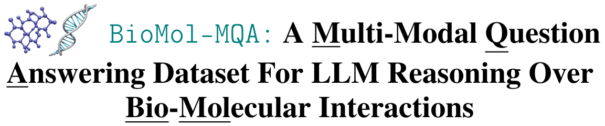

This repository contains the code for our dataset _BioMol-MQA: A Multi Modal Question Answering Dataset For LLM Reasoning
Over Bio Molecular Interactions_. BioMol-MQA is an _LLM-generated_ dataset whose queries involve reasoning over three
distinct modalities, viz., knowledge-graph, raw text and molecular SMILES (Simplified Molecular Input Line Entry System)
strings. The questions in our dataset are related to _polypharmacy_, i.e., the phenomena of taking two or more drugs to 
treat multiple ailments. Polypharmacy is a serious issue as taking the wrong drug combination can prove fatal. Additionally,
as more people use LLMs to answer medical queries, they need to be robust at handling such polypharmacy-related questions.
As such, our dataset provides a good testbed to evaluate model performance in dealing with this topic.

### Dataset Sample

The following instance is a sample from the _training_ split of our dataset.

```yaml
Entities: Famotidine-Metolazone
Question_Background: ajkshd
    
Question: Which medication, either a histamine H2 receptor antagonist that decreases 
  stomach acid production or a thiazide-like diuretic primarily used for congestive 
  heart failure and hypertension, is specifically associated with the management of 
  right heart failure in combination with the other, according to known drug 
  interactions?
Answer: Metolazone
Label: 0
```


### Citation
If you found our dataset useful for your project, please consider citing it 😄

```txt
@article{sengupta2025biomol,
  title={BioMol-MQA: A Multi-Modal Question Answering Dataset For LLM Reasoning Over Bio-Molecular Interactions},
  author={Sengupta, Saptarshi and Yang, Shuhua and Yu, Paul Kwong and Wang, Fali and Wang, Suhang},
  journal={arXiv preprint arXiv:2506.05766},
  year={2025}
}
```